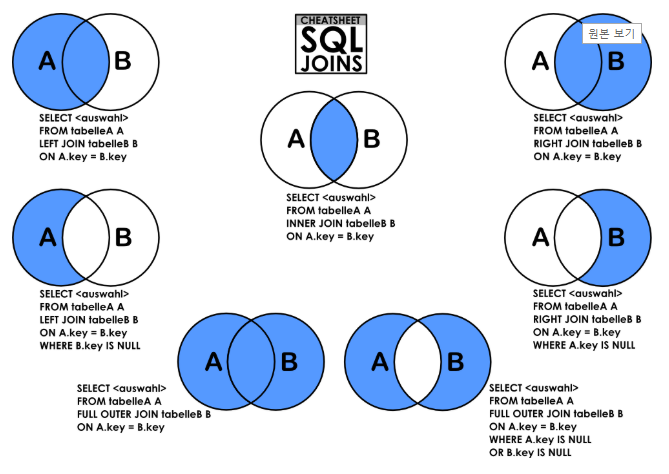

# Algorithm - SQL

SQL 문제를 풀기 위해 SQL 문법을 정리해놓은 문서입니다. 

## SQL 문법

- Appendix

  ```mysql
  -- base_table을 tableA라 별칭
  SELECT tableA.column FROM base_table tableA
  
  -- 올림 CEILING(값) : 정수로 출력됨
  SELECT CEILING(10.32)  -- 결과: 11
  
  -- 반올림 ROUND(값, 위치)
  SELECT ROUND(10.3543, 2)   -- 결과: 10.36
  SELECT ROUND(15.3542, -1)  -- 결과: 20
  
  -- 내림 FLOOR(값) : 정수로 출력됨
  SELECT FLOOR(-9.32)  -- 결과: -10
  
  -- 소수점 자르기 TRUNCATE(값, 위치)
  SELECT TRUNCATE(1234.56, 1) -- 결과: 1234.5
  SELECT TRUNCATE(1234.56, -2) -- 결과: 1230
  ```

  

- `SELECT` <출력하고자 하는 컬럼> FROM <타깃 테이블>

  - 조회

    ```mysql
    -- Select All
    SELECT * FROM <table>;
    
    -- Select using AND/OR
    SELECT * FROM <table> WHERE <조건식1> AND <조건식2>;
    
    -- Select column with limits
    SELECT * FROM <table_name> LIMIT 2,2; 
    ```


- `GROUP BY`

  - 특정 칼럼을 기준으로 데이터를 그룹핑

    ```mysql
    -- Group cloumn
    SELECT <column> FROM <table> GROUP BY <target_coulumn>;
    
    -- Group column using option
    SELECT <column> FROM <table> WHERE <조건식> GROUP BY <target_column>;
    
    -- 조건처리 (HAVING)
    SELECT <column> FROM <table> GROUP BY <target_column> HAVING <조건식>
    ```

  - **WHERE과 HAVING의 차이**

    - WHERE: 모든 필드를 조건에 둘 수 있습니다.

    - HAVING: 그룹핑된 새로운 테이블에 조건을 주게 됩니다

    - 예시

      | column1 | column2    |
      | ------- | ---------- |
      | 1       | 인사       |
      | 2       | hi         |
      | 2       | hello      |
      | 3       | 안녕하세요 |
      | 3       | 안녕       |

      ```mysql
      SELECT column1, COUNT(column2) AS cnt FROM <table> WHERE column1<3 GROUP BY column1 HAVING cnt>1;
      /* 결과
      |  column1	|  cnt	|
      |  2		|  2	|
      */
      ```


- `JOIN`

  - 복수의 테이블을 하나의 테이블처럼 출력

    

    - INNER JOIN

      - 조인하려는 테이블 모두에 데이터가 존재하는 행에 대해서만 결과를 출력(교집합)

        ```mysql
        SELECT tableA.column, tableB.column FROM base_table INNER JOIN <table> ON tableA.key = tableB.key
        ```

        ```mysql
        SELECT student.name, teacher.name FROM student INNER JOIN teacher ON student.classNo = teacher.classNo
        ```

        

    - OUTER JOIN
      - 매칭되는 데이터가 없는 경우 null로 표시되어 결과를 출력

      - `FROM` 에 적어준 테이블이 `LEFT`, `JOIN`에 적어준 테이블이 `RIGHT`

      - [예시 참고](https://doorbw.tistory.com/223)

      - LEFT JOIN

        ```mysql
        SELECT tableA.column, tableB.column FROM tableA LEFT OUTER JOIN tableB ON tableA.key = tableB.key
        ```

        테이블 A의 모든 열이 출력되며, 없는 경우 NULL로 표시됩니다.

      - RIGHT JOIN

        ```mysql
        SELECT tableA.column, tableB.column FROM tableA RIGHT OUTER JOIN tableB ON tableA.key = tableB.key
        ```

      - FULL OUTER JOIN (합집합)

        ```mysql
        SELECT tableA.column, tableB.column FROM tableA FULL OUTER JOIN tableB ON tableA.key = tableB.key
        ```

    

    - CROSS JOIN

      - 두 테이블간 가능한 모든 경우의 수를 출력(순열)

        ```mysql
        SELECT tableA.column, tableB.column FROM tableA CROSS JOIN tableB
        ```

        모든 경우의 수를 출력하기 때문에 ON구문이 없어진다.

        

    - SELF JOIN

      - 자기 자신을 JOIN한다. (다른 조인과는 달리 별칭을 선택이 아닌 필수로 입력)

        ```
        SELECT tableA.column, tableB.column FROM table tableA JOIN table tableB ON tableA.key = tableB.key
        ```

        
